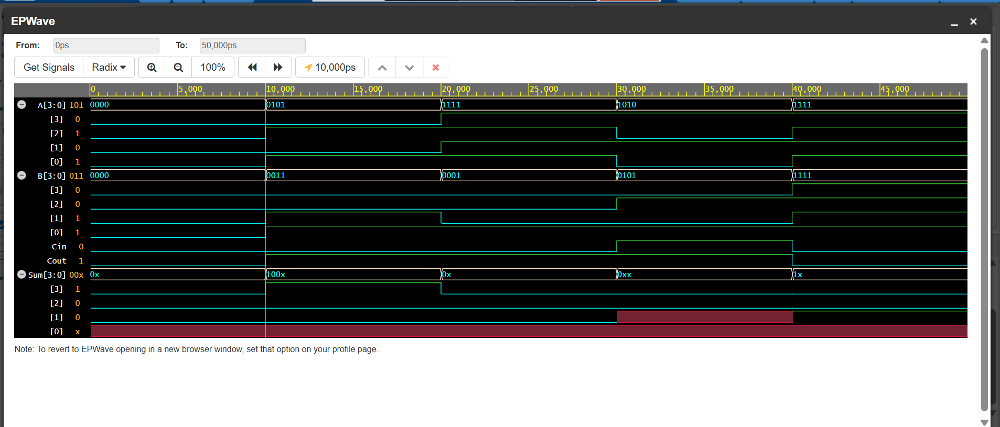

# Day 18 – Carry Look-Ahead Adder (Behavioral Modeling)

## Problem Statement

Design and simulate a **Carry Look-Ahead Adder (CLA)** in Verilog using **behavioral modeling** to perform fast binary addition for two 4-bit numbers with a carry-in input.

##  Objective

* Implement a **4-bit Carry Look-Ahead Adder** to improve addition speed compared to ripple carry adders.
* Learn how **propagate (P)** and **generate (G)** logic minimizes carry propagation delay.
* Verify functionality using a Verilog testbench and waveform simulation.

## Working Principle

A Carry Look-Ahead Adder computes carry signals in parallel using:

* **Generate (G) = A & B** → Carry generated from bits.
* **Propagate (P) = A ^ B** → Carry propagated from previous stage.
* Carry equations:

  ```
  C1 = G0 + (P0 & Cin)
  C2 = G1 + (P1 & C1)
  C3 = G2 + (P2 & C2)
  C4 = G3 + (P3 & C3)   → Final Carry Out
  ```
* Sum:

  ```
  S = P ^ C
  ```

---

## Truth Table (Example)

| A (4-bit) | B (4-bit) | Cin | Sum (4-bit) | Cout |
| --------- | --------- | --- | ----------- | ---- |
| 0000      | 0000      | 0   | 0000        | 0    |
| 0101      | 0011      | 0   | 1000        | 0    |
| 1111      | 1111      | 0   | 1110        | 1    |
| 1010      | 0101      | 1   | 0000        | 1    |

## Simulation Result



* **No ripple delay** observed — sum and carry outputs update immediately after inputs change.
* Matches expected CLA functionality.
